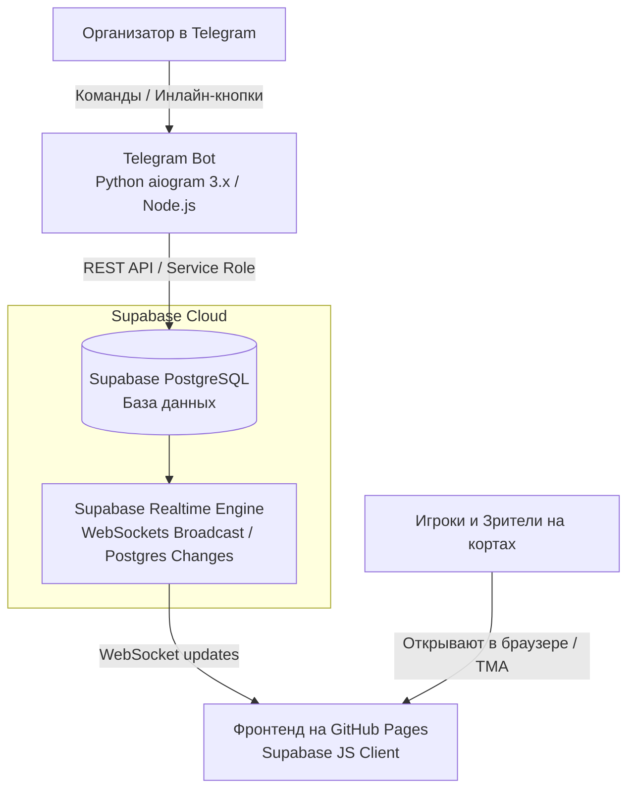

# Техническое Задание (ТЗ): Интеграция Telegram-бота, Supabase и Сайта (Вариант 1)

> **Статус документа:** На рассмотрении (планирование)  
> **Цель:** Организовать оперативное управление турниром через Telegram-бота (регистрация участников, жеребьевка, ввод результатов матчей в реальном времени) с мгновенным отображением на статическом фронтенде GitHub Pages без перезагрузки страниц.

---

## 1. Общая архитектура и концепция системы



### Ключевые принципы:
1. **GitHub Pages остается бесплатным статическим хостингом:** никакого сложного SSR или платного веб-сервера.
2. **Supabase (Free Tier):** выступает единым источником истины (Single Source of Truth) — хранит состояние турнира, список игроков, группы, расписание и результаты игр.
3. **Telegram Bot:** интерфейс ввода администратора. Никаких форм авторизации с паролями на сайте — бот авторизует организатора по его `telegram_user_id` (белый список админов).
4. **Мгновенная реактивность (Live Score):** зрители и игроки видят обновленный счет и изменение позиций в таблице через WebSockets в течение ~100–300 мс после ввода счета в боте.

---

## 2. Модель данных (Схема базы данных Supabase)

В базе создается схема из 4 основных таблиц:

### 2.1. Таблица `tournaments`
Метаданные турнира и текущий статус.
- `id` (text, PK) — например, `'picklehead-individual-doubles'`.
- `title` (text) — `'Picklehead Main Stage'`.
- `stage` (text) — `'registration'` | `'groups'` | `'playoffs'` | `'completed'`.
- `is_draw_completed` (boolean) — завершена ли жеребьевка.
- `settings` (jsonb) — параметры форматов, тай-брейков, кортов.

### 2.2. Таблица `players`
Реестр участников турнира (32 человека + резерв).
- `id` (int, PK / Generated) — номер слота / ID игрока.
- `tournament_id` (text, FK -> tournaments.id).
- `name` (text) — имя и фамилия игрока (например, `"Ho"`, `"Eugen"`).
- `dupr_id` (text, nullable) — подтвержденный DUPR ID.
- `dupr_rating` (numeric, nullable) — числовой рейтинг DUPR (для разрешения ничьих).
- `group_name` (text, nullable) — `'Group A'` ... `'Group H'`.
- `seed_rank` (int, nullable) — итоговый номер посева (1..32).
- `registered_at` (timestamptz) — время регистрации.

### 2.3. Таблица `group_matches`
Все матчи групповой стадии Americano (48 матчей: 8 групп по 6 матчей).
- `id` (uuid, PK).
- `tournament_id` (text).
- `group_name` (text) — `'Group A'` ... `'Group H'`.
- `round_number` (int) — 1..6.
- `court_id` (text) — `'c1'`, `'c2'`, `'c3'`, `'c4'`.
- `pair1_names` (text[]) — массив имен пары 1 (например `['Игрок 1', 'Игрок 2']`).
- `pair2_names` (text[]) — массив имен пары 2.
- `score1` (int, nullable) — набранные очки пары 1.
- `score2` (int, nullable) — набранные очки пары 2.
- `is_completed` (boolean, default false).
- `updated_at` (timestamptz).

### 2.4. Таблица `playoff_matches`
Матчи стадии плей-офф (1/4 финала, 1/2 финала, Гранд-Финал).
- `id` (text, PK) — например, `'qf-1'`, `'qf-2'`, `'sf-1'`, `'gf'`.
- `round_type` (text) — `'quarterfinal'` | `'semifinal'` | `'final'`.
- `court_id` (text).
- `team1_name` (text) — например, `'Team 1 (W1 + R8)'`.
- `team2_name` (text).
- `sets` (jsonb) — массив сетов (например, `[{"s1": 11, "s2": 7}, {"s1": 9, "s2": 11}, {"s1": 11, "s2": 8}]`).
- `winner_team` (int, nullable) — 1 или 2.
- `is_completed` (boolean, default false).

---

## 3. Функционал Telegram-бота (Интерфейс ввода)

Бот разрабатывается на **Python (aiogram 3.x)** или **Node.js (grammY)** и хостится на легком VPS или Railway/Render.

### 3.1. Аутентификация и безопасность
- В `.env` задается список `ADMIN_TELEGRAM_IDS = [12345678, ...]`.
- Неавторизованные пользователи получают только режим чтения/просмотра расписания.

### 3.2. Сценарии работы в боте:

#### Сценарий А. Регистрация и управление ростером
1. `/players` — вывод текущего списка зарегистрированных игроков (с номерами и DUPR).
2. `/add_player <Имя> [DUPR_ID] [Рейтинг]` — добавление игрока в список.
3. `/del_player <ID_или_Имя>` — удаление/замена игрока.
4. `/import_roster` — отправка текстового списка сразу на 32 игрока для мгновенного заполнения.

#### Сценарий Б. Жеребьевка (Draw)
1. `/draw` — запускает генерацию случайного посева по группам A–H (Fisher-Yates).
2. Бот присылает сообщение с составом каждой из 8 групп и кнопкой подтверждения:
   - `[Подтвердить и опубликовать на сайт]`
   - `[Перемешать заново]`
3. При подтверждении: бот записывает распределение игроков и создает 48 матчей группового этапа в таблице `group_matches`. На сайте сетка мгновенно переключается из режима "ожидание" в боевой режим.

#### Сценарий В. Ввод результатов матчей (Быстро и без ошибок)
*Так как на турнире шумно и некогда писать длинные команды, ввод строится через интерактивные клавиатуры (Inline Buttons):*
1. Команда `/matches` или выбор меню **«Ввод счета»**:
   - Бот предлагает выбрать корт: `[Корт 1] [Корт 2] [Корт 3] [Корт 4]`.
   - Затем выводит текущий активный/несыгранный матч на этом корте (например: `Группа А · Раунд 1: Ho & Eugen VS Denis & Alex`).
2. Ввод счета двумя нажатиями:
   - Шаг 1: Очки первой пары (кнопки от 0 до 15).
   - Шаг 2: Очки второй пары.
   - Либо быстрый ввод строкой: `11 7` или `11-7`.
3. Подтверждение: бот за 1 секунду пишет данные в Supabase.

#### Сценарий Г. Автоматический подсчет таблиц и переход в Плей-офф
1. При завершении всех 6 раундов в группе, бот автоматически ранжирует игроков:
   - Считает `Played`, `Wins`, `Losses`, `Point Diff (+/-)`, `Total Points Scored`.
   - Назначает `1-е место (Winner)` и `2-е место (Runner-Up)`.
2. После завершения всех 8 групп бот выполняет процедуру посева плей-офф:
   - Ранжирует победителей W1..W8 и вторых мест R1..R8 по очкам/диффу/забитым.
   - Формирует пары плей-офф по формуле $W_k + R_{9-k}$ (Team 1: W1+R8, Team 2: W2+R7...).
   - Заполняет 4 матча 1/4 финала.
   - Присылает организатору отчет: *"Групповой этап завершен! Сетка плей-офф сформирована и опубликована на сайте."*

---

## 4. Модификация фронтенда (`app.js` на GitHub Pages)

Фронтенд трансформируется из чисто локального просмотрщика данных в реактивный клиент:

### 4.1. Подключение Supabase Realtime SDK
В `index.html` добавляется легковесный CDN-скрипт:
```html
<script src="https://cdn.jsdelivr.net/npm/@supabase/supabase-js@2"></script>
```

### 4.2. Инициализация и загрузка данных
В `app.js` настраивается подключение через публичный `anon_key` (безопасный ключ только для чтения через RLS):
```javascript
const supabase = window.supabase.createClient(SUPABASE_URL, SUPABASE_ANON_KEY);

// 1. Первичная загрузка актуального состояния турнира
async function loadTournamentState() {
  const { data: matches } = await supabase.from('group_matches').select('*');
  const { data: players } = await supabase.from('players').select('*');
  const { data: playoff } = await supabase.from('playoff_matches').select('*');
  
  // Обновляем память приложения и перерисовываем таблицы
  updateAppState(matches, players, playoff);
  renderAllViews();
}
```

### 4.3. Слушатель изменений в реальном времени (WebSockets)
```javascript
// 2. Подписка на любые изменения счета или состава
supabase
  .channel('tournament-live')
  .on('postgres_changes', { event: '*', schema: 'public', table: 'group_matches' }, payload => {
    handleMatchUpdate(payload.new);
  })
  .on('postgres_changes', { event: '*', schema: 'public', table: 'playoff_matches' }, payload => {
    handlePlayoffUpdate(payload.new);
  })
  .on('postgres_changes', { event: '*', schema: 'public', table: 'players' }, payload => {
    handleRosterUpdate(payload.new);
  })
  .subscribe();
```

### 4.4. Fallback-механизм (Offline / Backup)
Если интернет на кортах кратковременно моргнет или нет связи с Supabase, приложение автоматически берет дефолтное состояние из локального `data.js`, обеспечивая 100% стабильность отображения расписания и отсутствие "белого экрана".

---

## 5. Этапы реализации проекта

| Этап | Задача | Результат |
|---|---|---|
| **Этап 1: База данных** | Создание бесплатного проекта Supabase, накат SQL-миграции с таблицами, индексами и Row Level Security (RLS — чтение всем, запись по токену бота). | Готовая БД и ключи API. |
| **Этап 2: Бот (Ядро)** | Написание бота на Python (aiogram 3): авторизация админа, модуль участников, жеребьевка. | Бот умеет наполнять БД игроками и распределять группы A-H. |
| **Этап 3: Бот (Счет матчей)** | Реализация логики ввода счета Americano (кнопки кортов, раундов, счетов) + авто-расчет тай-брейкеров (Diff / Total Points). | Бот оперативно обновляет матчи и определяет победителей групп. |
| **Этап 4: Плей-офф пайплайн** | Логика посева $W_k + R_{9-k}$ и перевод победителей 1/4 в 1/2 и в Финал. | Полный цикл турнира от регистрации до кубка. |
| **Этап 5: Фронтенд** | Внедрение Supabase Client в `app.js`, подключение подписки WebSockets, плавная анимация обновления очков в таблице. | Мгновенный Live-скоринг на сайте. |
| **Этап 6: Тестирование** | Прогон симуляции турнира (32 игрока, 48 групповых игр, плей-офф). | Проверка устойчивости к нагрузке и ничьим. |

---

## 6. Требуемые вводные для старта

Когда будете готовы запускать реализацию, потребуются:
1. Аккаунт на [supabase.com](https://supabase.com) (создается за 1 минуту через GitHub).
2. Токен бота из Telegram от `@BotFather`.
3. Ваш `Telegram User ID` (чтобы прописать в права суперадмина).
